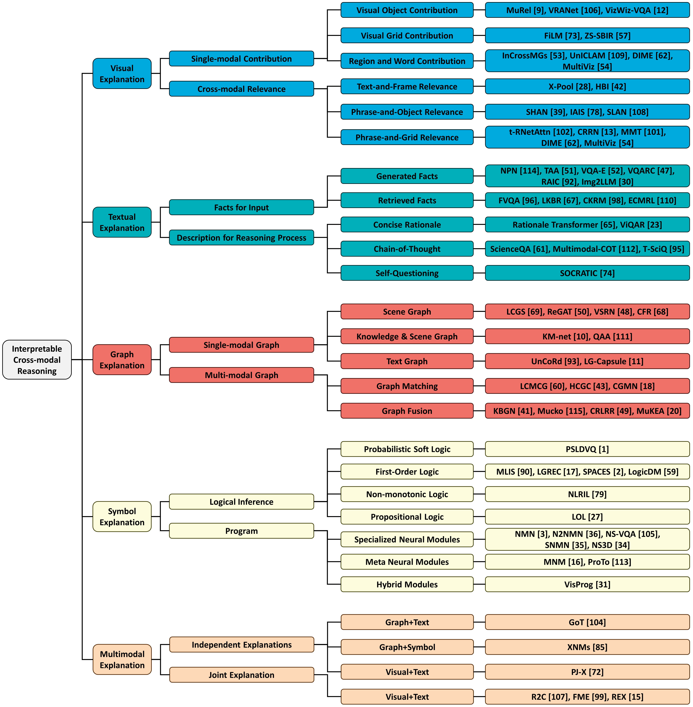

# <p align=center>A Survey on Interpretable Cross-modal Reasoning

[](https://awesome.re)
[](https://arxiv.org/abs/2309.01955)


[](https://hits.seeyoufarm.com)


> [**A Survey on Interpretable Cross-modal Reasoning**](https://arxiv.org/abs/2309.01955)<br>
[Dizhan Xue](https://scholar.google.com/citations?user=V5Aeh_oAAAAJ),
[Shengsheng Qian](https://scholar.google.com/citations?user=bPX5POgAAAAJ),
[Zuyi Zhou](https://orcid.org/0009-0008-0306-8461),
and [Changsheng Xu](https://scholar.google.com/citations?user=hI9NRDkAAAAJ)
> **<p align="justify"> Abstract:** *In recent years, cross-modal reasoning (CMR), the process of understanding and reasoning across different modalities, has emerged as a  pivotal area with applications spanning from multimedia analysis to healthcare diagnostics. As the deployment of AI systems becomes  more ubiquitous, the demand for transparency and comprehensibility in these systems’ decision-making processes has intensified. This survey delves into the realm of interpretable cross-modal reasoning (I-CMR), where the objective is not only to achieve high  predictive performance but also to provide human-understandable explanations for the results. This survey presents a comprehensive  overview of the typical methods with a three-level taxonomy for I-CMR. Furthermore, this survey reviews the existing CMR datasets  with annotations for explanations. Finally, this survey summarizes the challenges for I-CMR and discusses potential future directions. In conclusion, this survey aims to catalyze the progress of this emerging research area by providing researchers with a panoramic and  comprehensive perspective, illuminating the state of the art and discerning the opportunities.* </p>

##  Citation

If you find our paper or this repo helpful for your research, please cite it as below. Thanks!

```bibtex
@article{xue2023survey,
  title={A Survey on Interpretable Cross-modal Reasoning},
  author={Xue, Dizhan and Qian, Shengsheng and Zhou, Zuyi and Xu, Changsheng},
  journal={arXiv preprint arXiv:2309.01955},
  year={2023}
}
```

## <span id="head-content"> *Content* </span>
* - [x] [1. Taxonomy](#headIntro)

* - [x] [2. Methods for interpretable cross-modal reasoning](#headtax)
  * - [x] [2.1 Methods of Visual Explanation](#head-1)
  * - [x] [2.2 Methods of Textual Explanation](#head-2)  
  * - [x] [2.3 Methods of Graph Explanation](#head-3)
  * - [x] [2.4 Methods of Symbol Explanation](#head-4)
  * - [x] [2.5 Methods of Multimodal Explanation](#head-5)
  
  
* - [x] [3. Datasets](#headda)  


* [*Contact Us*](#head7)

## <span id="headIntro"> *1. Taxonomy* </span>

* In this survey, we present a three-level taxonomy for inter-pretable cross-modal reasoning methods, as follows:




## <span id="headtax"> *2. Methods for interpretable cross-modal reasoning* </span>

### <span id="head-1"> *2.1 Methods of Visual Explanation* </span>

**MUREL: Multimodal Relational Reasoning for Visual Question Answering** [CVPR 2019] <br>
Remi Cadene, Hedi Ben-Younes, Matthieu Cord, and Nicolas Thome.  <br>
[[Paper]](https://ieeexplore.ieee.org/document/8953864)[[Code]](https://github.com/Cadene/murel.bootstrap.pytorch)

**Reasoning on the Relation: Enhancing Visual Representation for Visual Question Answering and Cross-Modal Retrieval** [TMM 2022]<br>
Jing Yu, Weifeng Zhang, Yuhang Lu, Zengchang Qin, Yue Hu, Jianlong Tan, and Qi Wu.  <br>
[[Paper]](https://ieeexplore.ieee.org/document/8988148) [[Code]](http://github.com/rosinality/relation-networks-pytorch)

**Grounding Answers for Visual Questions Asked by Visually Impaired People** [CVPR 2022]<br>
Chongyan Chen, Samreen Anjum, and Danna Gurari.  <br>
[[Paper]](https://arxiv.org/pdf/2202.01993.pdf) [[Code]](https://vizwiz.org/tasks-and-datasets/answergrounding-for-vqa)

**FiLM: Visual Reasoning with a General Conditioning Layer** [AAAI 2018]<br>
Ethan Perez, Florian Strub, Harm De Vries, Vincent Dumoulin, and Aaron Courville.  <br>
[[Paper]](https://arxiv.org/pdf/1709.07871.pdf) [[Code]](https://github.com/ethanjperez/film)

**Zero-Shot Everything Sketch-Based Image Retrieval, and in Explainable Style** [CVPR 2023]<br>
Fengyin Lin, Mingkang Li, Da Li, Timothy Hospedales, Yi-Zhe Song, and Yonggang Qi.  <br>
[[Paper]](https://arxiv.org/pdf/2303.14348.pdf) [[Code]](https://github.com/buptLinfy/ZSE-SBIR)

**Multi-Modal Sarcasm Detection with Interactive In-Modal and Cross-Modal Graphs** [ACM MM 2021]<br>
Bin Liang, Chenwei Lou, Xiang Li, Lin Gui, Min Yang, and Ruifeng Xu.  <br>
[[Paper]](https://dl.acm.org/doi/10.1145/3474085.3475190)

**UnICLAM: Contrastive Representation Learning with Adversarial Masking for Unified and Interpretable Medical Vision Question Answering** [arXiv 2022]<br>
Chenlu Zhan, Peng Peng, Hongsen Wang, Tao Chen, and Hongwei Wang.  <br>
[[Paper]](https://arxiv.org/pdf/2212.10729.pdf)

**DIME: Fine-grained Interpretations of Multimodal Models via Disentangled Local Explanations** [AIES 2022]<br>
Yiwei Lyu, Paul Pu Liang, Zihao Deng, Ruslan Salakhutdinov, and Louis-Philippe Morency.  <br>
[[Paper]](https://arxiv.org/pdf/2203.02013.pdf) [[Code]](https://github.com/lvyiwei1/DIME)

**MultiViz: Towards Visualizing and Understanding Multimodal Models** [ICLR 2023]<br>
Paul Pu Liang, Yiwei Lyu, Gunjan Chhablani, Nihal Jain, Zihao Deng, Xingbo Wang, Louis-Philippe Morency, and Ruslan Salakhutdinov.  <br>
[[Paper]](https://arxiv.org/pdf/2207.00056.pdf) [[Code]](https://github.com/pliang279/MultiViz)

**X-Pool: Cross-Modal Language-Video Attention For Text-Video Retrieval** [CVPR 2022]<br>
Satya Krishna Gorti, Noël Vouitsis, Junwei Ma, Keyvan Golestan, Maksims Volkovs, Animesh Garg, and Guangwei Yu.  <br>
[[Paper]](https://arxiv.org/pdf/2203.15086.pdf) [[Code]](https://layer6ai-labs.github.io/xpool/)

**Video-Text as Game Players: Hierarchical Banzhaf Interaction for Cross-Modal Representation Learning** [CVPR 2023]<br>
Peng Jin, Jinfa Huang, Pengfei Xiong, Shangxuan Tian, Chang Liu, Xiangyang Ji, Li Yuan, and Jie Chen.  <br>
[[Paper]](https://arxiv.org/pdf/2303.14369.pdf) [[Code]](https://jpthu17.github.io/HBI/)

**Step-Wise Hierarchical Alignment Network for Image-Text Matching** [IJCAI 2021]<br>
Zhong Ji, Kexin Chen, and Haoran Wang.  <br>
[[Paper]](https://arxiv.org/pdf/2106.06509v1.pdf)

**Learning Relation Alignment for Calibrated Cross-modal Retrieval** [ACL-IJCNLP 2021]<br>
Shuhuai Ren, Junyang Lin, Guangxiang Zhao, Rui Men, An Yang, Jingren Zhou, Xu Sun, and Hongxia Yang.  <br>
[[Paper]](https://arxiv.org/pdf/2105.13868.pdf) [[Code]](https://github.com/lancopku/IAIS)

**SLAN: Self-Locator Aided Network for Cross-Modal Understanding** [arXiv 2022]<br>
Jiang-Tian Zhai, Qi Zhang, Tong Wu, Xing-Yu Chen, Jiang-Jiang Liu, Bo Ren, and Ming-Ming Cheng.  <br>
[[Paper]](https://arxiv.org/pdf/2211.16208.pdf)

**Robust and Interpretable Grounding of Spatial References with Relation Networks** [EMNLP 2020]<br>
Tsung-Yen Yang, Andrew Lan, and Karthik Narasimhan.  <br>
[[Paper]](https://arxiv.org/pdf/2005.00696.pdf) [[Code]](https://sites.google.com/view/robust-relation-net/home)

**Cross-modal Relational Reasoning Network for Visual Question Answering** [ICCV 2021]<br>
Hongyu Chen, Ruifang Liu, and Bo Peng.  <br>
[[Paper]](https://ieeexplore.ieee.org/document/9607451)

**MMT: Image-guided Story Ending Generation with Multimodal Memory Transformer** [ACM MM 2023]<br>
Dizhan Xue, Shengsheng Qian, Quan Fang, and Changsheng Xu.  <br>
[[Paper]](https://dl.acm.org/doi/10.1145/3503161.3548022) [[Code]](https://github.com/LivXue/MMT)


### <span id="head-2"> *2.2 Methods of Textual Explanation* </span>

**More Than An Answer: Neural Pivot Network for Visual Qestion Answering** [ACM MM 2017]<br>
Yiyi Zhou, Rongrong Ji, Jinsong Su, YongjianWu, and YunshengWu.  <br>
[[Paper]](https://dl.acm.org/doi/abs/10.1145/3123266.3123335)

**Tell-and-Answer: Towards Explainable Visual Question Answering using Attributes and Captions** [EMNLP 2018]<br>
Qing Li, Jianlong Fu, Dongfei Yu, Tao Mei, and Jiebo Luo.  <br>
[[Paper]](https://arxiv.org/pdf/1801.09041.pdf)


**VQA-E: Explaining, Elaborating, and Enhancing Your Answers for Visual Questions** [ECCV 18]<br>
Qing Li, Qingyi Tao, Shafiq Joty, Jianfei Cai, and Jiebo Luo.  <br>
[[Paper]](https://arxiv.org/pdf/1803.07464.pdf)

**Visual Question Answering as Reading Comprehension** [CVPR 2019]<br>
Hui Li, Peng Wang, Chunhua Shen, and Anton van den Hengel.  <br>
[[Paper]](https://arxiv.org/pdf/1811.11903.pdf)

**Relation-Aware Image Captioning for Explainable Visual Question Answering** [TAAI 2022]<br>
Ching-Shan Tseng, Ying-Jia Lin, and Hung-Yu Kao.  <br>
[[Paper]](https://ieeexplore.ieee.org/document/10056492)

**From Images to Textual Prompts: Zero-shot Visual Question Answering with Frozen Large Language Models** [CVPR 2023]<br>
Jiaxian Guo, Junnan Li, Dongxu Li, Anthony Meng Huat Tiong, Boyang Li, Dacheng Tao, and Steven Hoi.  <br>
[[Paper]](https://arxiv.org/pdf/2212.10846.pdf) [[Code]](https://github.com/salesforce/LAVIS/tree/main/projects/img2llm-vqa)

**FVQA: Fact-based Visual Question Answering** [T-PAMI 2017]<br>
PengWang, QiWu, Chunhua Shen, Anthony Dick, and Anton Van Den Hengel.  <br>
[[Paper]](https://arxiv.org/pdf/1606.05433.pdf)

**Straight to the Facts: Learning Knowledge Base Retrieval for Factual Visual Question Answering** [ECCV 2018]<br>
Medhini Narasimhan and Alexander G Schwing.  <br>
[[Paper]](https://arxiv.org/pdf/1809.01124.pdf)

**Multi-Level Knowledge Injecting for Visual Commonsense Reasoning** [TCSVT 2020]<br>
Zhang Wen and Yuxin Peng. 2020.  <br>
[[Paper]](https://ieeexplore.ieee.org/abstract/document/9083951)

**Explicit Cross-Modal Representation Learning For Visual Commonsense Reasoning** [TMM 2012]<br>
Xi Zhang, Feifei Zhang, and Changsheng Xu.  <br>
[[Paper]](https://ieeexplore.ieee.org/document/9465732)

**TiNatural Language Rationales with Full-Stack Visual Reasoning: From Pixels to Semantic Frames to Commonsense Graphstle** [EMNLP 2020]<br>
Ana Marasović, Chandra Bhagavatula, Jae sung Park, Ronan Le Bras, Noah A Smith, and Yejin Choi.  <br>
[[Paper]](https://arxiv.org/pdf/2010.07526.pdf) [[Code]](https://github.com/allenai/visual-reasoning-rationalization)

**Beyond VQA: Generating Multi-word Answers and Rationales to Visual Questions** [CVPR 2021]<br>
Radhika Dua, Sai Srinivas Kancheti, and Vineeth N Balasubramanian. <br>
[[Paper]](https://arxiv.org/pdf/2010.12852.pdf)

**Learn to Explain: Multimodal Reasoning via Thought Chains for Science Question Answering** [NeurIPS 2022]<br>
Pan Lu, Swaroop Mishra, Tanglin Xia, Liang Qiu, Kai-Wei Chang, Song-Chun Zhu, Oyvind Tafjord, Peter Clark, and Ashwin Kalyan.  <br>
[[Paper]](https://arxiv.org/pdf/2209.09513.pdf) [[Code]](https://scienceqa.github.io/)

**Multimodal Chain-of-Thought Reasoning in Language Models** [arXiv 2023]<br>
Zhuosheng Zhang, Aston Zhang, Mu Li, Hai Zhao, George Karypis, and Alex Smola.  <br>
[[Paper]](https://arxiv.org/pdf/2302.00923.pdf) [[Code]](https://github.com/amazon-science/mm-cot)

**T-SciQ: Teaching Multimodal Chain-of-Thought Reasoning via Large Language Model Signals for Science Question Answering** [arXiv 2023]<br>
Lei Wang, Yi Hu, Jiabang He, Xing Xu, Ning Liu, Hui Liu, and Heng Tao Shen.  <br>
[[Paper]](https://arxiv.org/pdf/2305.03453.pdf)

**The Art of SOCRATIC QUESTIONING: Zero-shot Multimodal Reasoning with Recursive Thinking and Self-Questioning** [arXiv 2023]<br>
Jingyuan Qi, Zhiyang Xu, Ying Shen, Minqian Liu, Di Jin, Qifan Wang, and Lifu Huang.  <br>
[[Paper]](https://arxiv.org/pdf/2305.14999.pdf)

### <span id="head-3"> *2.3 Methods of Graph Explanation* </span>

**Learning Conditioned Graph Structures for Interpretable Visual Question Answering** [NeurIPS 2018]<br>
Will Norcliffe-Brown, Stathis Vafeias, and Sarah Parisot.  <br>
[[Paper]](https://arxiv.org/pdf/1806.07243.pdf) [[Code]](https://github.com/aimbrain/vqa-project)

**Relation-Aware Graph Attention Network for Visual Question Answering** [ICCV 2019]<br>
Linjie Li, Zhe Gan, Yu Cheng, and Jingjing Liu. <br>
[[Paper]](https://arxiv.org/pdf/1903.12314.pdf) [[Code]](https://github.com/linjieli222/VQA_ReGAT)

**Visual Semantic Reasoning for Image-Text Matching** [ICCV 2019]<br>
Kunpeng Li, Yulun Zhang, Kai Li, Yuanyuan Li, and Yun Fu.  <br>
[[Paper]](https://arxiv.org/pdf/1909.02701.pdf) [[Code]](https://github.com/KunpengLi1994/VSRN)

**Coarse-to-Fine Reasoning for Visual Question Answering** [CVPR 2023]<br>
Binh X Nguyen, Tuong Do, Huy Tran, Erman Tjiputra, Quang D Tran, and Anh Nguyen..  <br>
[[Paper]](https://arxiv.org/pdf/2110.02526.pdf) [[Code]](https://github.com/aioz-ai/CFR_VQA)

**Explainable High-Order Visual Question Reasoning: A New Benchmark and Knowledgerouted Network** [arXiv 2019]<br>
Qingxing Cao, Bailin Li, Xiaodan Liang, and Liang Lin.  <br>
[[Paper]](https://arxiv.org/pdf/1909.10128.pdf)

**Query and Attention Augmentation for Knowledge-Based Explainable Reasoning** [CVPR 2022]<br>
Yifeng Zhang, Ming Jiang, and Qi Zhao.  <br>
[[Paper]](https://ieeexplore.ieee.org/document/9879458) [[Code]](https://github.com/SuperJohnZhang/QAA)

**VQA with No Questions-Answers Training** [CVPR 2020]<br>
Ben-Zion Vatashsky and Shimon Ullman.  <br>
[[Paper]](https://arxiv.org/abs/1811.08481.pdf) [[Code]](https://github.com/benyv/uncord)

**Linguistically Driven Graph Capsule Network for Visual Question Reasoning** [arXiv 2020]<br>
Qingxing Cao, Xiaodan Liang, Keze Wang, and Liang Lin.  <br>
[[Paper]](https://arxiv.org/pdf/2003.10065.pdf) [[Code]]

**Learning Cross-Modal Context Graph for Visual Grounding** [AAAI 2020]<br>
Yongfei Liu, Bo Wan, Xiaodan Zhu, and Xuming He.  <br>
[[Paper]](https://arxiv.org/pdf/1911.09042.pdf)  [[Code]](https://github.com/youngfly11/LCMCG-PyTorch)

**Hierarchical Cross-Modal Graph Consistency Learning for Video-Text Retrieval** [SIGIR 2021]<br>
Weike Jin, Zhou Zhao, Pengcheng Zhang, Jieming Zhu, Xiuqiang He, and Yueting Zhuang.  <br>
[[Paper]](https://dl.acm.org/doi/abs/10.1145/3404835.3462974)

**Cross-modal Graph Matching Network for Image-Text Retrieval** [TOMM 2022]<br>
Yuhao Cheng, Xiaoguang Zhu, Jiuchao Qian, Fei Wen, and Peilin Liu.  <br>
[[Paper]](https://dl.acm.org/doi/10.1145/3499027) [[Code]](https://github.com/cyh-sj/CGMN)

**KBGN: Knowledge-Bridge Graph Network for Adaptive Vision-Text Reasoning in Visual Dialogue** [ACM MM 2020]<br>
Xiaoze Jiang, Siyi Du, Zengchang Qin, Yajing Sun, and Jing Yu.  <br>
[[Paper]](https://arxiv.org/pdf/2008.04858.pdf)

**Mucko: Multi-Layer Cross-Modal Knowledge Reasoning for Fact-Based Visual Question Answering** [IJCAI 2021]<br>
Zihao Zhu, Jing Yu, Yujing Wang, Yajing Sun, Yue Hu, and Qi Wu.  <br>
[[Paper]](https://arxiv.org/pdf/2006.09073.pdf)

**Cross-modal Representation Learning and Relation Reasoning for Bidirectional Adaptive Manipulation** [IJCAI 2022]<br>
Lei Li, Kai Fan, and Chun Yuan.  <br>
[[Paper]](https://www.ijcai.org/proceedings/2022/447)

**MuKEA: Multimodal Knowledge Extraction And Accumulation For Knowledgebased Visual Question Answering** [CVPR 2022]<br>
Yang Ding, Jing Yu, Bang Liu, Yue Hu, Mingxin Cui, and Qi Wu.  <br>
[[Paper]](https://arxiv.org/pdf/2203.09138.pdf) [[Code]](https://github.com/AndersonStra/MuKEA) 

### <span id="head-4"> *2.4 Methods of Symbol Explanation* </span>

**Explicit Reasoning over End-to-End Neural Architectures for Visual Question Answering** [AAAI 2018]<br>
Somak Aditya, Yezhou Yang, and Chitta Baral.  <br>
[[Paper]](https://arxiv.org/pdf/1803.08896.pdf)

**Multimodal Logical Inference System for Visual-Textual Entailment** [ACL SRW 2019]<br>
NamRiko Suzuki, Hitomi Yanaka, Masashi Yoshikawa, Koji Mineshima, and Daisuke Bekki.  <br>
[[Paper]](https://arxiv.org/pdf/1906.03952.pdf)

**Exploring Logical Reasoning for Referring Expression Comprehension** [ACM MM 2021]<br>
Ying Cheng, Ruize Wang, Jiashuo Yu, Rui-Wei Zhao, Yuejie Zhang, and Rui Feng.  <br>
[[Paper]](https://dl.acm.org/doi/abs/10.1145/3474085.3475677)

**SPACES: Explainable Multimodal AI for Active Surveillance, Diagnosis, and Management of Adverse Childhood Experiences (ACEs)** [Big Dat 2021]<br>
Nariman Ammar, Parya Zareie, Marion E Hare, Lisa Rogers, Sandra Madubuonwu, Jason Yaun, and Arash Shaban-Nejad.  <br>
[[Paper]](https://ieeexplore.ieee.org/document/9671303)

**Interpretable Multimodal Misinformation Detection with Logic Reasoning** [arXiv 2023]<br>
Hui Liu, Wenya Wang, and Haoliang Li.  <br>
[[Paper]](https://arxiv.org/pdf/2305.05964.pdf) [[Code]](https://github.com/less-and-less-bugs/LogicMD)

**Integrating Non-monotonic Logical Reasoning and Inductive Learning with Deep Learning for Explainable Visual Question Answering** [FRAI 6 2019]<br>
Heather Riley and Mohan Sridharan.  <br>
[[Paper]](https://www.frontiersin.org/articles/10.3389/frobt.2019.00125/full) [[Code]](https://github.com/hril230/masters_code) 

**VQA-LOL: Visual Question Answering Under the Lens of Logic** [ECCV 2022]<br>
Tejas Gokhale, Pratyay Banerjee, Chitta Baral, and Yezhou Yang.  <br>
[[Paper]](https://arxiv.org/pdf/2002.08325.pdf)

**Neural Module Networks** [CVPR 2016]<br>
Jacob Andreas, Marcus Rohrbach, Trevor Darrell, and Dan Klein.  <br>
[[Paper]](https://arxiv.org/pdf/1511.02799.pdf)

**Learning to Reason: End-to-End Module Networks for Visual Question Answering** [ICCV 2017]<br>
Ronghang Hu, Jacob Andreas, Marcus Rohrbach, Trevor Darrell, and Kate Saenko.  <br>
[[Paper]](https://arxiv.org/pdf/1704.05526.pdf)

**Neural-Symbolic VQA: Disentangling Reasoning from Vision and Language Understanding** [NeurIPS 2018]<br>
Kexin Yi, Jiajun Wu, Chuang Gan, Antonio Torralba, Pushmeet Kohli, and Josh Tenenbaum.  <br>
[[Paper]](https://arxiv.org/pdf/1810.02338.pdf) [[Code]](http://nsvqa.csail.mit.edu) 

**Explainable Neural Computation via Stack Neural Module Networks** [ECCV 2018]<br>
Ronghang Hu, Jacob Andreas, Trevor Darrell, and Kate Saenko.  <br>
[[Paper]](https://arxiv.org/pdf/1807.08556.pdf)

**NS3D: Neuro-Symbolic Grounding of 3d Objects and Relations** [CVPR 2023]<br>
Joy Hsu, Jiayuan Mao, and Jiajun Wu.  <br>
[[Paper]](https://arxiv.org/pdf/2303.13483.pdf) [[Code]](https://github.com/joyhsu0504/NS3D)

**Meta Module Network for Compositional Visual Reasoning** [WACV 2021]<br>
Wenhu Chen, Zhe Gan, Linjie Li, Yu Cheng, William Wang, and Jingjing Liu.  <br>
[[Paper]](https://arxiv.org/pdf/1910.03230.pdf) [[Code]](https://github.com/wenhuchen/Meta-Module-Network)

**ProTo: Program-Guided Transformer for Program-Guided Tasks** [NeurIPS 2021]<br>
Zelin Zhao, Karan Samel, Binghong Chen, et al.  <br>
[[Paper]](https://arxiv.org/pdf/2110.00804.pdf) [[Code]](https://github.com/sjtuytc/Neurips21-ProTo-Program-guided-Transformers-for-Program-guided-Tasks)

**Visual Programming: Compositional Visual Reasoning without Training** [CVPR 2023]<br>
Tanmay Gupta and Aniruddha Kembhavi.  <br>
[[Paper]](https://arxiv.org/pdf/2211.11559.pdf) [[Code]](https://prior.allenai.org/projects/visprog)

### <span id="head-5"> *2.5 Methods of Multimodal Explanation* </span>

**Beyond Chain-of-Thought, Effective Graph-of-Thought Reasoning in Large Language Models** [arXiv 2023]<br>
Yao Yao, Zuchao Li, and Hai Zhao. 2023.  <br>
[[Paper]](https://arxiv.org/pdf/2305.16582.pdf) 

**Explainable and Explicit Visual Reasoning over Scene Graphs** [CVPR 2019]<br>
Jiaxin Shi, Hanwang Zhang, and Juanzi Li.  <br>
[[Paper]](https://arxiv.org/pdf/1812.01855.pdf) [[Code]](https://github.com/shijx12/XNM-Net)

**Multimodal Explanations: Justifying Decisions and Pointing to the Evidence** [CVPR 2018]<br>
Dong Huk Park, Lisa Anne Hendricks, Zeynep Akata, Anna Rohrbach, Bernt Schiele, Trevor Darrell, and Marcus Rohrbach.  <br>
[[Paper]](https://ieeexplore.ieee.org/document/8579013)

**From Recognition to Cognition: Visual Commonsense Reasoning** [CVPR 2019]<br>
Rowan Zellers, Yonatan Bisk, Ali Farhadi, and Yejin Choi.  <br>
[[Paper]](https://arxiv.org/pdf/1811.10830.pdf) [[Code]](https://visualcommonsense.com/)


**Faithful Multimodal Explanation for Visual Question Answering** [arXiv 2019]<br>
Jialin Wu and Raymond J. Mooney.  <br>
[[Paper]](https://arxiv.org/pdf/1809.02805.pdf)

**REX: Reasoning-Aware and Grounded Explanation** [CVPR 2022]<br>
Shi Chen and Qi Zhao.  <br>
[[Paper]](https://arxiv.org/pdf/2203.06107v1.pdf) [[Code]](https://github.com/szzexpoi/rex)

## <span id="headda"> *3. Datasets* </span>

<!--Visual Genome  -->
**Visual Genome: Connecting Language and Vision Using Crowdsourced Dense Image Annotations** [IJCV 2017]<br>
Ranjay Krishna, Yuke Zhu, Oliver Groth, Justin Johnson, Kenji Hata, Joshua Kravitz, Stephanie Chen, Yannis Kalantidis, Li-Jia Li, David A Shamma, et al.  <br>
[[Paper]](https://arxiv.org/pdf/1602.07332.pdf) [[Dataset]](https://homes.cs.washington.edu/~ranjay/visualgenome/index.html)

<!--GQA  -->
**GQA: A New Dataset for Real-World Visual Reasoning and Compositional Question Answering** [CVPR 2019]<br>
Drew A Hudson and Christopher D Manning.  <br>
[[Paper]](https://arxiv.org/pdf/1902.09506.pdf) [[Dataset]](https://cs.stanford.edu/people/dorarad/gqa/about.html)

<!--GQA-REX  -->
**REX: Reasoning-Aware And Grounded Explanation** [CVPR 2022]<br>
Shi Chen and Qi Zhao.  <br>
[[Paper]](https://arxiv.org/pdf/2203.06107v1.pdf) [[Dataset]](https://github.com/szzexpoi/rex)

<!--FVQA  -->
**FVQA: Fact-based Visual Question Answering** [T-PAMI 2017]<br>
Peng Wang, Qi Wu, Chunhua Shen, Anthony Dick, and Anton Van Den Hengel.  <br>
[[Paper]](https://arxiv.org/pdf/1606.05433.pdf) [[Dataset]](https://github.com/wangpengnorman/FVQA)

<!--VQA-e  -->
**VQA-E: Explaining, Elaborating, and Enhancing Your Answers for Visual Questions** [ECCV 18]<br>
Qing Li, Qingyi Tao, Shafiq Joty, Jianfei Cai, and Jiebo Luo.  <br>
[[Paper]](https://arxiv.org/pdf/1803.07464.pdf) [[Dataset]](https://github.com/liqing-ustc/VQA-E)

<!--OK-VQA +VCR -->
**From Recognition to Cognition: Visual Commonsense Reasoning** [CVPR 2019]<br>
Rowan Zellers, Yonatan Bisk, Ali Farhadi, and Yejin Choi.  <br>
[[Paper]](https://arxiv.org/pdf/1811.10830.pdf) [[Dataset]](https://visualcommonsense.com/)


<!-- kvqa -->
**KVQA: Knowledge-Aware Visual Question Answering** [AAAI 2019]<br>
Sanket Shah, Anand Mishra, Naganand Yadati, and Partha Pratim Talukdar.  <br>
[[Paper]](https://dl.acm.org/doi/10.1609/aaai.v33i01.33018876) [[Dataset]](http://malllabiisc.github.io/resources/kvqa)

<!-- 2D-M -->
**Program Guided Agent** [ICLR 2019]<br>
Shao-Hua Sun, Te-Lin Wu, and Joseph J Lim.  <br>
[[Paper]](https://openreview.net/pdf?id=BkxUvnEYDH)

<!-- Mocheg -->
**End-to-End Multimodal Fact-Checking And Explanation Generation: A Challenging Dataset and Models** [SIGIR 2023]<br>
Barry Menglong Yao, Aditya Shah, Lichao Sun, Jin-Hee Cho, and Lifu Huang.  <br>
[[Paper]](https://arxiv.org/pdf/2205.12487.pdf) [[Dataset]](https://github.com/VT-NLP/Mocheg)

<!-- ACT-X -->
**Multimodal Explanations: Justifying Decisions and Pointing to the Evidence** [CVPR 2018]<br>
Dong Huk Park, Lisa Anne Hendricks, Zeynep Akata, Anna Rohrbach, Bernt Schiele, Trevor Darrell, and Marcus Rohrbach.  <br>
[[Paper]](https://ieeexplore.ieee.org/document/8579013) [[Dataset]](https://github.com/Seth-Park/MultimodalExplanations)

<!-- ScienceQA -->
**Learn to Explain: Multimodal Reasoning via Thought Chains for Science Question Answering** [NeurIPS 2022]<br>
Pan Lu, Swaroop Mishra, Tanglin Xia, Liang Qiu, Kai-Wei Chang, Song-Chun Zhu, Oyvind Tafjord, Peter Clark, and Ashwin Kalyan.  <br>
[[Paper]](https://arxiv.org/pdf/2209.09513.pdf) [[Dataset]](https://scienceqa.github.io/)

<!-- HatReD -->
**Decoding the Underlying Meaning of Multimodal Hateful Memes** [arXiv 2023]<br>
Ming Shan Hee, Wen-Haw Chong, and Roy Ka-Wei Lee.  <br>
[[Paper]](https://arxiv.org/pdf/2305.17678.pdf) [[Dataset]](https://github.com/Social-AI-Studio/HatRed)

<!-- WAX -->
**WAX: A New Dataset for Word Association eXplanations** [ACL-IJCNLP 2023]<br>
Chunhua Liu, Trevor Cohn, Simon De Deyne, and Lea Frermann.  <br>
[[Paper]](https://aclanthology.org/2022.aacl-main.9.pdf) [[Dataset]](https://github.com/ChunhuaLiu596/WAX)


## <span id="head7"> *Contact Us* </span>

Please contact us by e-mail:

```bash
xuedizhan17@mails.ucas.ac.cn
```

```bash
shengsheng.qian@nlpr.ia.ac.cn
```

```bash
zhouzuyi2023@ia.ac.cn
```